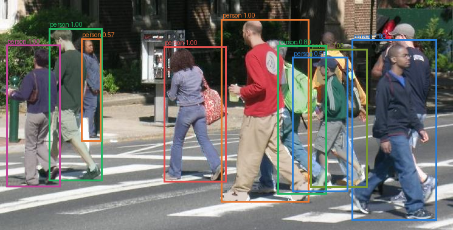

# Kaggle 协议 v2 参考训练

[English](README.md) | [Kaggle kernel version 2](https://www.kaggle.com/code/yashowhoo/pytorch-instance-segmentation-lab-penn-fudan-gpu) | [流程](../guides/kaggle.zh-CN.md) | [ADR 0002](../architecture/0002-evaluation-and-splits.zh-CN.md)

状态：`COMPLETE_PROTOCOL_V2`

替代训练已在 Kaggle Tesla T4 完成全部 20 epoch，使用按来源分层的 manifests 和保留完整置信度排序的 COCO AP。第 10 轮只由验证集 `mask_map` 选出，随后在固定 17 张 test 图片上评估一次。

| 协议 v2 项目 | 结果 |
|---|---:|
| 最佳验证 mask AP | **0.766694** |
| 测试 mask AP / AP50 / AP75 | **0.756093** / 1.000000 / 0.855337 |
| 测试 bbox AP / AP50 / AP75 | **0.846439** / 1.000000 / 0.935175 |
| 测试 mask AR@100 / bbox AR@100 | 0.782500 / 0.872500 |
| 测试图片 / 目标 / 指标预测 | 17 / 40 / 54 |
| score 0.5 下分析预测 / FP / FN | 45 / 5 / 0 |
| 训练 / 评估 / 总耗时 | 537.431s / 4.609s / 585.735s |

## 排序后的错误分析

评估器为 AP 保留全部预测，同时单独使用 score 0.5 生成可读错误分析。排名最高的样本包含 6 个匹配目标和 3 个额外预测；分析阈值下 40 个 test 目标全部被匹配。

真实单图预测、JSON 记录和二值 mask 位于 [`predictions/FudanPed00028/`](predictions/FudanPed00028/instances.json)。

## 可审计产物

- [`run.yaml`](run.yaml)：协议、环境、耗时、指标、identity 与 hash 汇总。
- [`MODEL_CARD.md`](MODEL_CARD.md)：用途、限制、checkpoint 位置与安全说明。
- [`config.yaml`](config.yaml)：Kaggle 实际路径、CUDA AMP 和阈值。
- [`environment.json`](environment.json)、[`events.jsonl`](events.jsonl)、[`metrics.csv`](metrics.csv)：结构化 provenance 和全部 20 epoch。
- [`kaggle-run-summary.json`](kaggle-run-summary.json)：runner 写入的未舍入结果。
- [`evaluation/`](evaluation/evaluation.json)：JSON、逐类/逐图 CSV，以及 4 组排序后的标注/预测图。
- [`kaggle/run_kaggle-v2.py`](kaggle/run_kaggle-v2.py)：本次 version 2 精确提交 runner，内嵌 archive SHA-256 为 `41fa5e...b24a`。
- [`kaggle/run_kaggle.py`](kaggle/run_kaggle.py)：未来提交使用的当前生成 runner。
- [`legacy-v1/`](legacy-v1/README.md)：保留的旧版 score-filtered 运行与报告。

334.8 MB 的 `best.pt` 和 `last.pt` 保留在私有 Kaggle kernel output。已验证 SHA-256 分别为 `1c28ed12...b3d57` 和 `bda01afe...2ad1`，只能作为可信 checkpoint 加载。
