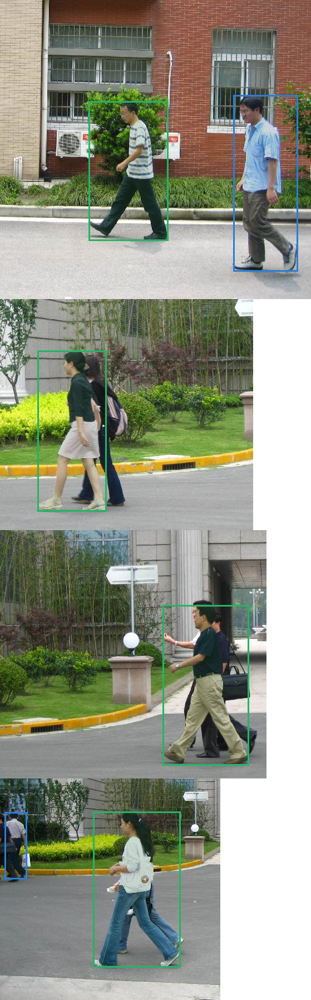

# Kaggle Legacy Run (Protocol v1)

> **Superseded:** this run filtered predictions at score `0.5` before AP calculation and used the old lexicographic split. Its values are historical, not protocol-v2 benchmark metrics. See [ADR 0002](../../architecture/0002-evaluation-and-splits.md).

[Chinese](README.zh-CN.md) | [Kaggle workflow](../../guides/kaggle.md) | [Reference config](https://github.com/Doithoo/pytorch-instance-segmentation-lab/blob/main/configs/reference_maskrcnn.yaml)

The original 20-epoch run completed successfully on a Kaggle Tesla T4 at [this kernel](https://www.kaggle.com/code/yashowhoo/pytorch-instance-segmentation-lab-penn-fudan-gpu). It proved the end-to-end GPU workflow, checkpoint selection, and artifact capture. The numeric results below use protocol v1 and must not be compared with standard unfiltered COCO AP.

The reference configuration is maintained in the [repository config directory](https://github.com/Doithoo/pytorch-instance-segmentation-lab/blob/main/configs/reference_maskrcnn.yaml).

| Legacy protocol-v1 item | Historical result |
|---|---:|
| Best validation mask AP | 0.795231 |
| Test mask AP / AP50 / AP75 | **0.791271** / 1.000000 / 0.966054 |
| Test bbox AP / AP50 / AP75 | **0.891579** / 1.000000 / 1.000000 |
| Test mask AR@100 / bbox AR@100 | 0.811429 / 0.911429 |
| Test images / targets / predictions | 17 / 35 / 37 |
| Training / test evaluation | 525.500s / 6.251s |
| Total Kaggle task time | 570.792s |

## Auditable artifacts

- [`config.yaml`](config.yaml): Kaggle-resolved paths, `cuda`, AMP, two workers, and all 20 epochs.
- [`run.yaml`](run.yaml): environment, split and source identities, timings, and checkpoint hashes.
- [`metrics.csv`](metrics.csv): all 20 train/validation epochs.
- [`kaggle-run-summary.json`](kaggle-run-summary.json): unrounded final values from the runner.
- [`evaluation/evaluation.json`](evaluation/evaluation.json), [`per_class.csv`](evaluation/per_class.csv), and [`per_image.csv`](evaluation/per_image.csv): final test result.
- [`evaluation/visualizations/`](evaluation/visualizations/4550134779599368474-ground-truth.png): four test-image ground-truth/prediction pairs.
- [`kaggle/run_kaggle-v1.py`](kaggle/run_kaggle-v1.py): exact generated runner submitted for this recorded version; its embedded archive SHA-256 is `c96eef...71d91`.
- [`../kaggle/run_kaggle.py`](../kaggle/run_kaggle.py): current generated runner for future submissions.

The 335 MB `best.pt` and `last.pt`, raw data, and complete prediction cache are intentionally not committed. Download them from the Kaggle kernel output. The evaluated `best.pt` SHA-256 is `af68b78d28b7b063e6932adc307a4db5f61f506409e88b9871447d45893bee6b`.
